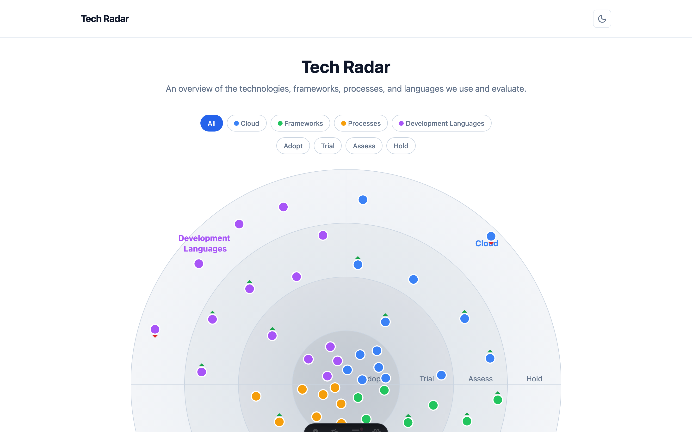
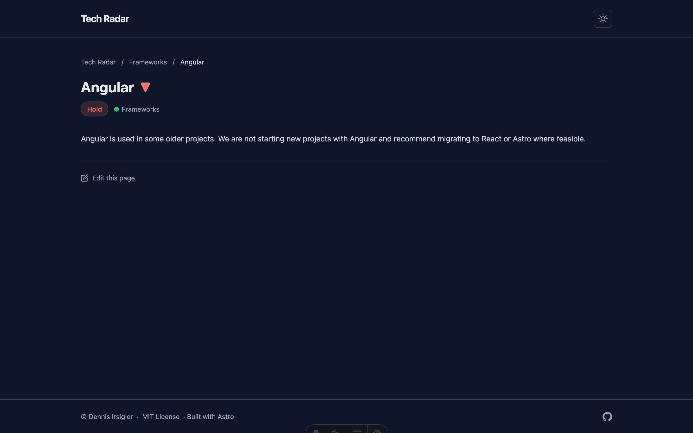
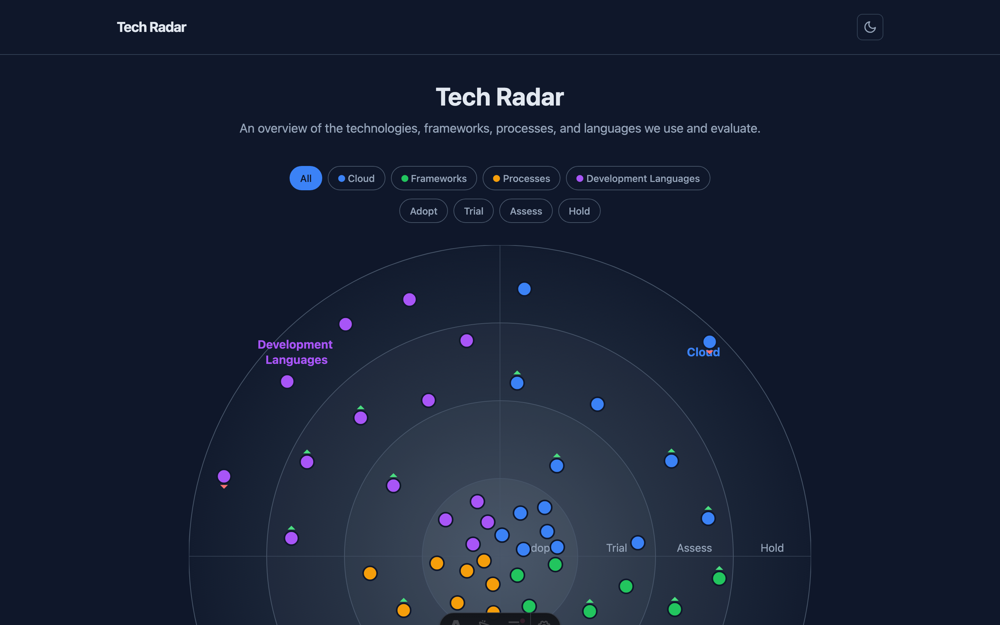
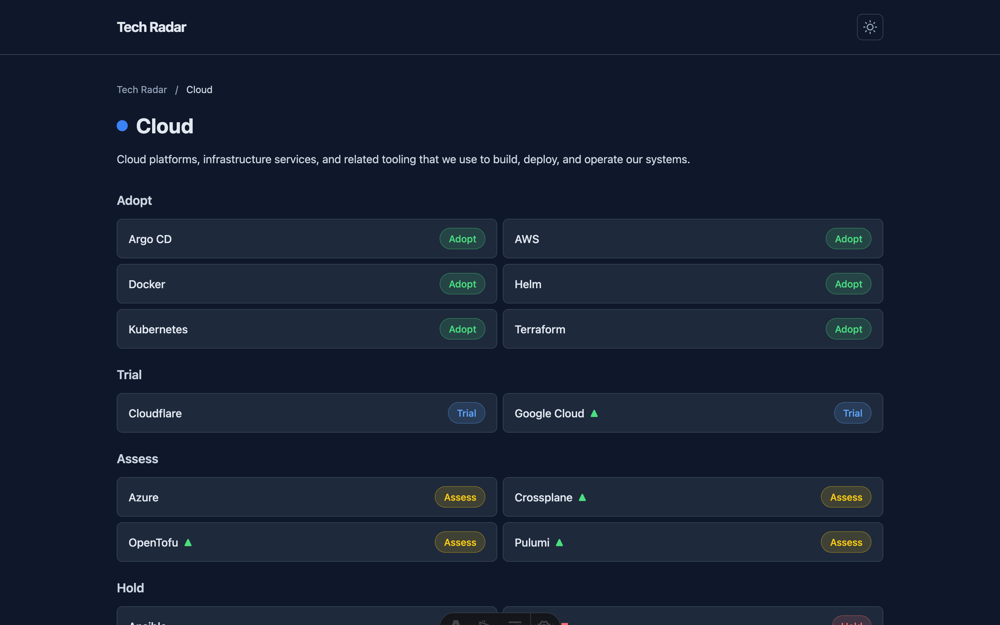

# @dirsigler/astro-techradar

[](https://www.npmjs.com/package/@dirsigler/astro-techradar)
[](https://astro.build)
[](LICENSE)

An [Astro](https://astro.build) integration that adds a complete, interactive technology radar to your site. Track technology adoption decisions across your organization with a visual radar chart, categorized segments, and detailed technology pages — all driven by simple Markdown files.

**[View Live Demo](https://demo.techradar.irsigler.dev)**

---

## Preview

|                  Radar Overview                  |                     Technology Detail                      |
| :----------------------------------------------: | :--------------------------------------------------------: |
|  |  |
|    |          |

---

## Features

- **Interactive SVG Radar** — Technologies plotted across four rings (Adopt, Trial, Assess, Hold) with hover tooltips and click-through navigation
- **Markdown-Driven** — Add technologies by dropping `.md` files into `segments/`. No code changes needed
- **Theming & Color Mode** — Ships with a default theme and [Catppuccin Mocha](https://catppuccin.com). Light/dark toggle, lockable color mode, or create your own theme with CSS custom properties
- **Fully Static & Fast** — Builds to plain HTML/CSS/JS. Deploy anywhere
- **Movement Indicators** — Mark technologies as moved in/out to highlight recent changes
- **SEO Ready** — Open Graph, Twitter Cards, canonical URLs, and custom 404 page

---

## Quick Start

### 1. Install

```bash
npm install @dirsigler/astro-techradar astro
```

### 2. Add the integration

```js
// astro.config.mjs
import { defineConfig } from "astro/config";
import techradar from "@dirsigler/astro-techradar";

export default defineConfig({
  site: "https://your-site.example.com",
  integrations: [
    techradar({
      title: "Tech Radar",
    }),
  ],
});
```

### 3. Define the content collections

Create `src/content.config.ts`:

```ts
import { defineCollection } from "astro:content";
import { glob } from "astro/loaders";
import { segmentSchema, technologySchema } from "@dirsigler/astro-techradar/schemas";

const segments = defineCollection({
  loader: glob({ pattern: "*/index.md", base: "./segments" }),
  schema: segmentSchema,
});

const technologies = defineCollection({
  loader: glob({ pattern: "*/!(index).md", base: "./segments" }),
  schema: technologySchema,
});

export const collections = { segments, technologies };
```

### 4. Add your content

```text
segments/
├── cloud/
│   ├── index.md          # Segment metadata
│   ├── kubernetes.md
│   └── terraform.md
├── frameworks/
│   ├── index.md
│   ├── astro.md
│   └── react.md
└── ...
```

Each segment needs an `index.md`:

```markdown
---
title: Cloud
color: "#3b82f6"
order: 1
---
```

Each technology file:

```markdown
---
title: Kubernetes
ring: adopt
moved: 0
---

Your description in Markdown. Explain why this technology is in this ring
and what your experience has been.
```

### 5. Run

```bash
npx astro dev
```

---

## Configuration

All options are passed to the `techradar()` integration in `astro.config.mjs`:

```js
techradar({
  // Required
  title: "Tech Radar",

  // Optional
  basePath: "/techradar", // Mount under a sub-path (e.g. acme.com/techradar/)
  logo: "/logo.svg", // Path to logo in public/
  footerText: "Built by the Platform Team", // Supports HTML
  editBaseUrl: "https://github.com/your-org/your-radar/edit/main/segments",
  theme: "default", // 'default' | 'catppuccin-mocha' | path to custom CSS
  color: {
    toggle: true, // Show the light/dark mode toggle (default: true)
    mode: "system", // 'light' | 'dark' | 'system' (default: 'system')
  },
  socialLinks: [
    {
      label: "GitHub",
      href: "https://github.com/your-org/your-radar",
      icon: "github", // Lucide icon name (requires @iconify-json/lucide)
    },
  ],
});
```

### Social Link Icons

Social links can optionally display [Lucide](https://lucide.dev) icons. If you use the `icon` field, install the icon set:

```bash
npm install @iconify-json/lucide
```

```js
socialLinks: [
  { label: "GitHub", href: "https://github.com/your-org", icon: "github" },
],
```

### Technology Frontmatter

| Field   | Type                                       | Description                                     |
| :------ | :----------------------------------------- | :---------------------------------------------- |
| `title` | `string`                                   | Display name                                    |
| `ring`  | `'adopt' \| 'trial' \| 'assess' \| 'hold'` | Which ring the technology belongs to            |
| `moved` | `-1 \| 0 \| 1`                             | Movement indicator (-1 = out, 0 = none, 1 = in) |

### Segment Frontmatter

| Field   | Type     | Description                  |
| :------ | :------- | :--------------------------- |
| `title` | `string` | Segment display name         |
| `color` | `string` | Hex color (e.g. `"#3b82f6"`) |
| `order` | `number` | Quadrant position (1-4)      |

---

## Theming

Themes are CSS files defining `--radar-*` custom properties.

| Theme              | Description                                           |
| :----------------- | :---------------------------------------------------- |
| `default`          | Clean light/dark theme (follows system preference)    |
| `catppuccin-mocha` | [Catppuccin Mocha](https://catppuccin.com) dark theme |

To create a custom theme, copy the [default theme](src/themes/default.css), save it in your project, and point to it:

```js
techradar({
  theme: "./src/my-theme.css",
});
```

### Color Mode

Control the light/dark mode behavior with the `color` option:

```js
// Default — toggle visible, follows system preference
techradar({ title: "Tech Radar" });

// Lock to dark mode, no toggle
techradar({
  title: "Tech Radar",
  color: { toggle: false, mode: "dark" },
});

// Lock to light mode, no toggle
techradar({
  title: "Tech Radar",
  color: { toggle: false, mode: "light" },
});
```

| Field    | Type                            | Default    | Description                                          |
| :------- | :------------------------------ | :--------- | :--------------------------------------------------- |
| `toggle` | `boolean`                       | `true`     | Show the light/dark mode toggle in the header        |
| `mode`   | `'light' \| 'dark' \| 'system'` | `'system'` | Color mode — locks the mode when `toggle` is `false` |

---

## Base Path

Mount the radar under a sub-path when embedding it into a larger Astro site:

```js
// Serves the radar at acme.com/techradar/
techradar({
  title: "ACME Tech Radar",
  basePath: "/techradar",
});
```

All routes and internal links are automatically prefixed. This works alongside Astro's own `base` config for full flexibility.

---

## Example

See the [techradar-demo](https://github.com/dirsigler/techradar-demo) repository for a complete working example.

---

## License

[MIT](LICENSE) — Dennis Irsigler
